# Data Query & Visualization Platform — Frontend Implementation

This is my implementation of the **Frontend** for the “Data Query & Visualization Platform” take-home assignment.  
I carefully went through the given brief, broke it down into deliverables, and focused on solving the real product and engineering challenges rather than just wiring screens.

---

## Understanding the Task

The frontend was expected to let users:

1. Connect or upload a **data source**  
2. Build **queries** that transform/aggregate data  
3. Create **visualizations** (charts/tables) from query results  
4. **Share dashboards** with different access levels (Admin, Editor, Viewer)

I structured the app to handle all these while ensuring smooth UX, performance, and scalability within the time constraint.

---

## My Approach & Design Choices

### 1. **Data Source Upload (CSV)**
Instead of overcomplicating with multiple sources, I focused on a clean **CSV upload flow** that instantly parses and stores dataset metadata in Redux for reusability across Query Builder and Chart Builder.  
I used Papaparse for large CSV handling (1000+ rows) with chunked parsing to keep the UI responsive.

**PS:** Handled large CSVs efficiently with async parsing + React Suspense to prevent blocking UI threads.

---

### 2. **Query Builder**
Built a fully interactive UI that lets users select **dimensions, metrics, filters, and aggregations (SUM, AVG, COUNT, etc.)** visually — no raw SQL.  
The state is fully typed and managed via Redux Toolkit slices to keep it predictable and easily extensible.

**PS:** Implemented “instant preview” — query results auto-refresh when parameters change, helping non-technical users see results live.

---

### 3. **Chart Builder**
Integrated **ApexCharts** and **Chart.js** for flexible chart types — Bar, Line, and Pie.  
Charts update automatically when query data changes and preserve configuration state even after navigation.

**PS:** Implemented a reusable `<ChartBuilder />` that unifies data mapping logic and supports dark/light theme out of the box.

---

### 4. **Dashboard Management**
Users can save and organize charts into dashboards, which are fetched and persisted through backend APIs.  
Each dashboard includes **access level** (private, public, shared) and optional sharing to specific users.

**PS:** I optimized the dashboard list and viewer mode to be role-aware — so viewers only see allowed dashboards, but editors/admins retain edit access dynamically.

---

### 5. **Role-Based Access Control**
Roles (Admin, Editor, Viewer) are simulated in frontend state and influence visibility, permissions, and UI availability.  
Protected routes ensure only valid roles access specific screens.

**PS:** Used `PrivateRoute` + centralized `useAuth` hook for role-based navigation; consistent across routes and layout components.

---

### 6. **State Management & Performance**
Used **Redux Toolkit** slices for `auth`, `chart`, `dashboard`, and `query`.  
Each slice isolates async logic via `createAsyncThunk` and uses normalized state.  

**PS:** Designed Redux slices so all CRUD operations are optimistic — UI updates instantly and rolls back if API fails, improving perceived performance.

---

### 7. **UI & Theming**
Built with **Material UI (MUI)** — consistent design system, full dark/light theme switcher, and responsive layouts.  
Dashboard and builder UIs use grid-based adaptive layouts for both desktop and laptop views.

**PS:** Extended MUI theme context for dynamic color palettes used across ApexCharts — ensuring chart color consistency across themes.

---


## Tech Stack

- React  
- TypeScript  
- Redux Toolkit  
- Material UI  
- ApexCharts / Chart.js  
- React Router  
- Axios  

## Roles and Capabilities

| Role   | Capabilities                                          |
| ------ | ----------------------------------------------------- |
| Admin  | Full access to users, charts, data, and dashboards    |
| Editor | Create and manage own queries, charts, and dashboards |
| Viewer | View shared and public dashboards                     |

## Folder Structure

```

src/
├── assets/                # Static images, icons, and resources
├── components/
│   ├── auth/              # Auth-related UI components
│   ├── charts/            # Chart visualization components
│   └── layout/            # Layout components (MainLayout)
├── pages/
│   ├── auth/              # Login/Register pages
│   ├── ChartBuilder/      # Chart creation page
│   ├── dashboard/         # Dashboard listing and viewing
│   ├── DataSource/        # CSV data upload and management
│   ├── Profile/           # Profile and role management
│   └── QueryBuilder/      # Query creation and testing
├── redux/
│   ├── slices/            # Redux slices (auth, chart, dashboard)
│   ├── store.ts           # Redux store configuration
│   └── types.ts           # Shared TypeScript types
├── routes/
│   ├── AppRoutes.tsx      # Route configuration
│   └── PrivateRoute.tsx   # Protected route wrapper
├── services/
│   └── apiService.ts      # Axios service wrapper
├── theme/                 # MUI theme configuration
├── App.tsx
├── App.css
├── index.css
└── main.tsx

````

## Setup

### 1. Install dependencies
```bash
npm install
````

### 2. Run the development server

```bash
npm run dev
```

### 3. Build for production

```bash
npm run build
```

## Environment Variables

Create a `.env` file in the root directory:

```
VITE_BACKEND_URL=http://localhost:5000
```

## Scripts

| Command         | Description                |
| --------------- | -------------------------- |
| `npm run dev`   | Start development server   |
| `npm run build` | Build production-ready app |
| `npm run lint`  | Run code linter            |

## Application Screenshots

| Login                                       | Register                                    |
| ------------------------------------------- | ------------------------------------------- |
| 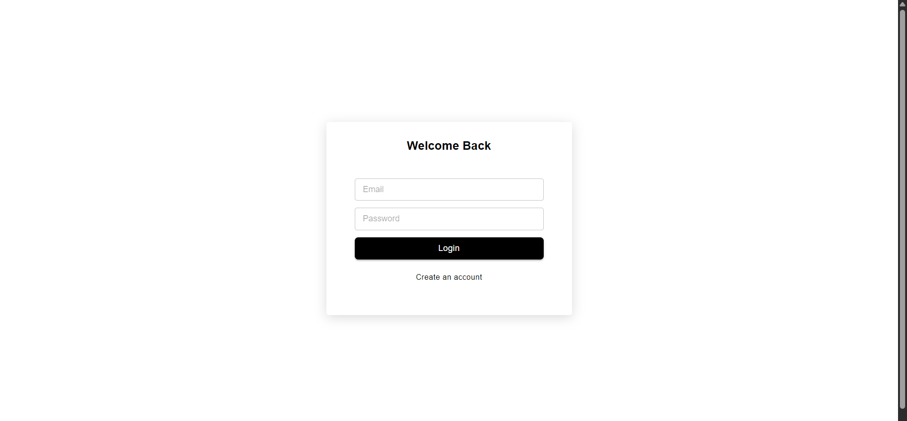 | 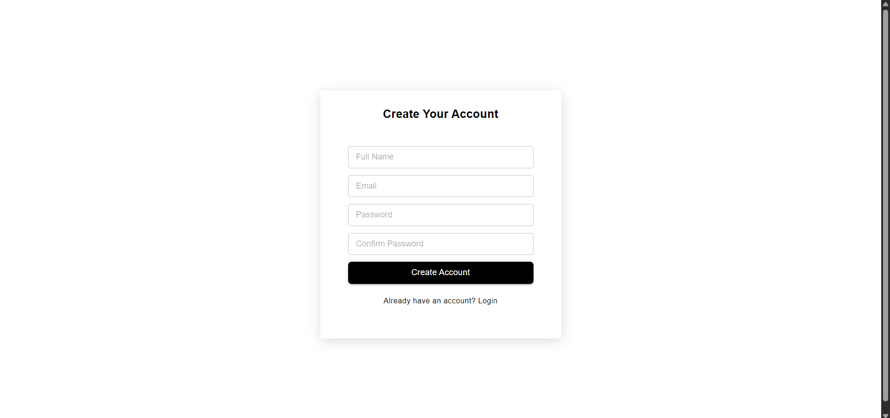 |

| Dashboard                                   | Data Source                                 |
| ------------------------------------------- | ------------------------------------------- |
| 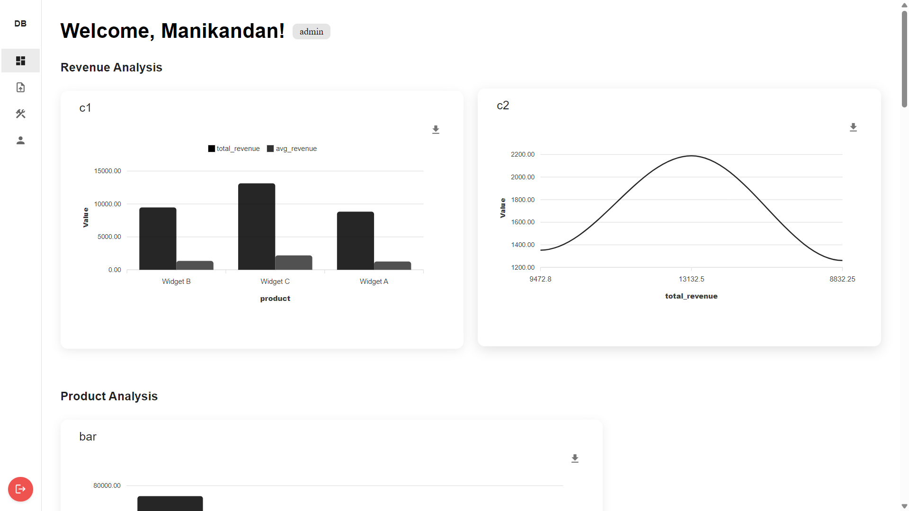 | 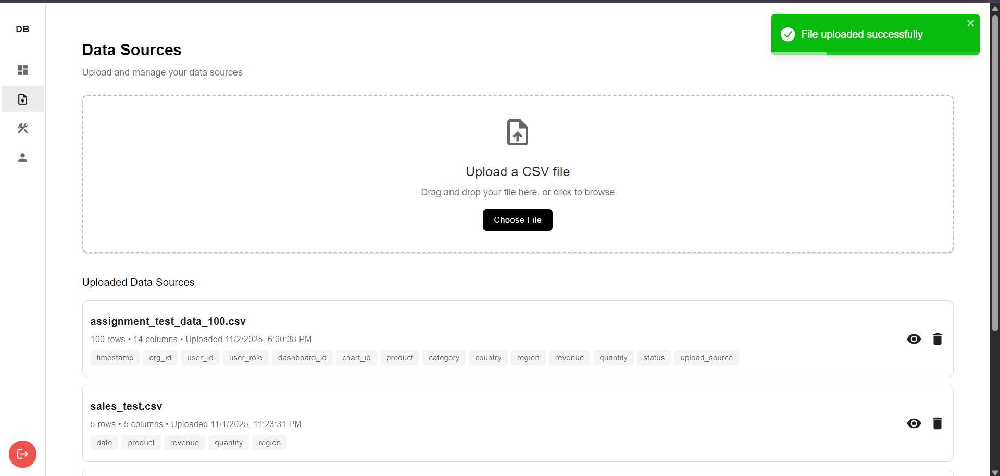 |

| CSV Preview                               | Query Builder & Result                                |
| ------------------------------------------- | ------------------------------------------- |
| 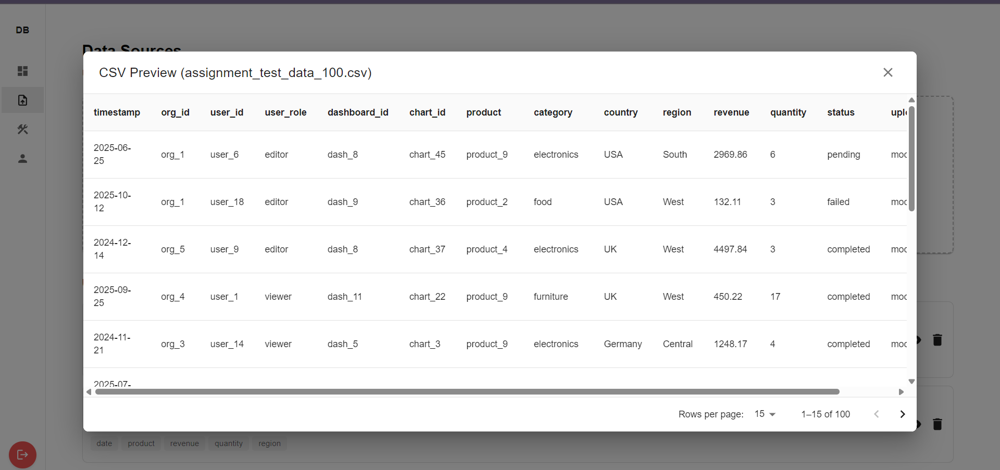 | 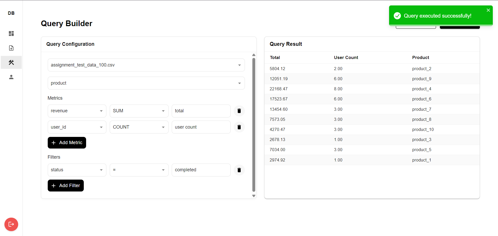 |

| Chart Builder with preview                  | Line Chart                                  |
| ------------------------------------------- | ------------------------------------------- |
| 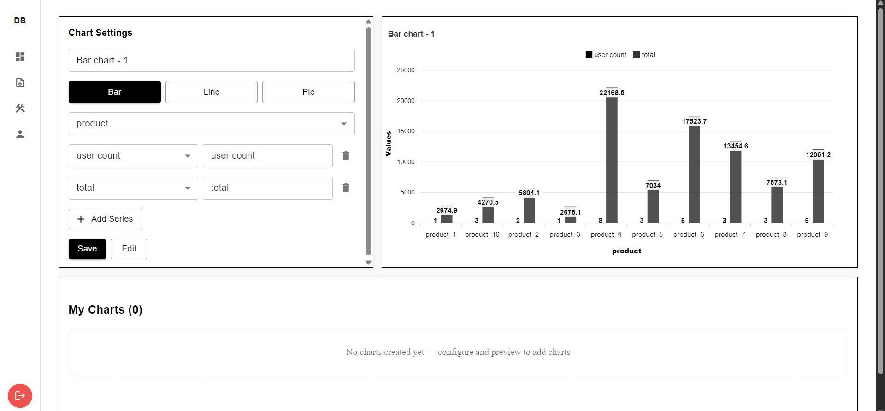 | 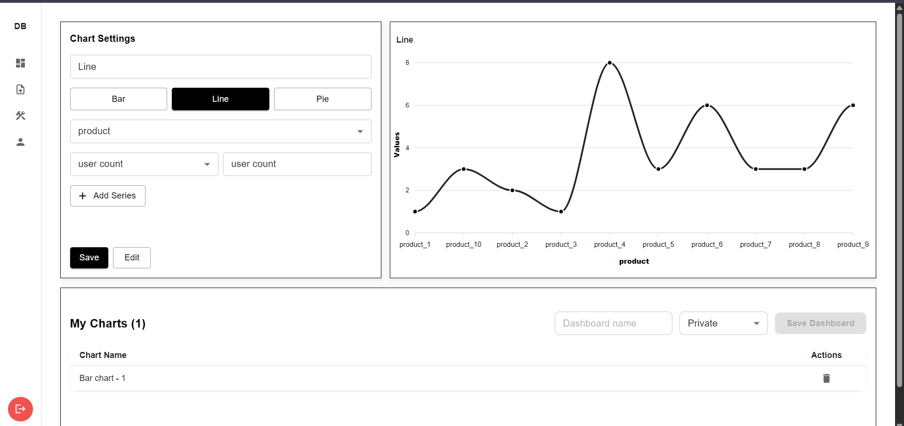 |

| Pie Chart View                              | Set Access Level & Publish Dashboard                                |
| ------------------------------------------- | -------------------------------------------- |
| 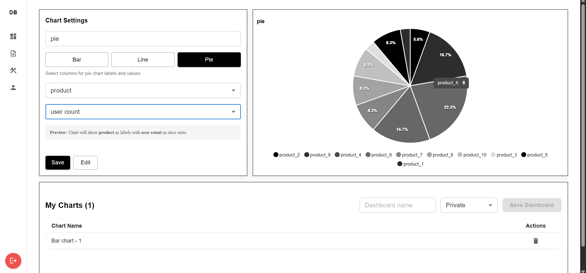 | 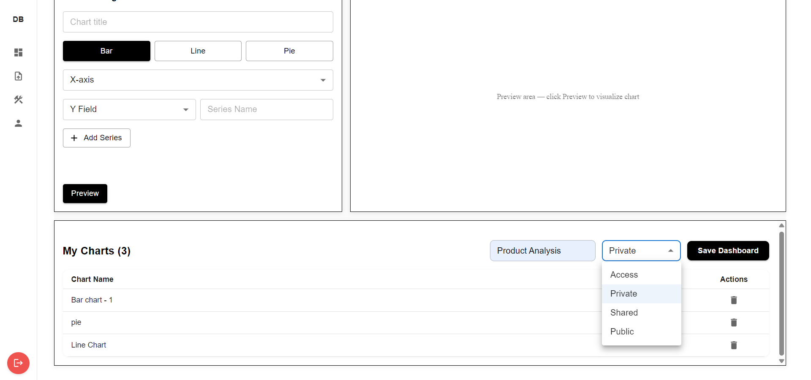 |

| Set Shared People                                      | Role Management                              |
| -------------------------------------------- | -------------------------------------------- |
| 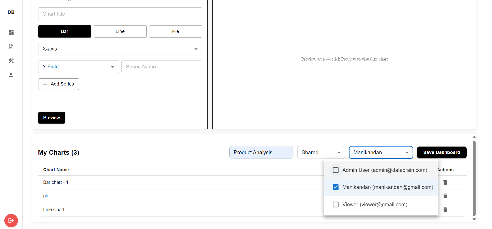 | 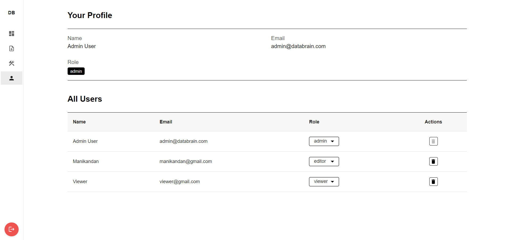 |
